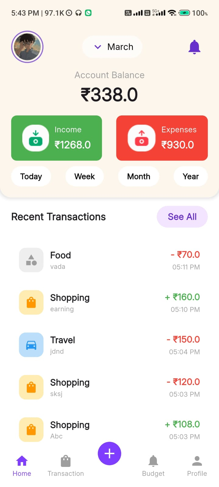
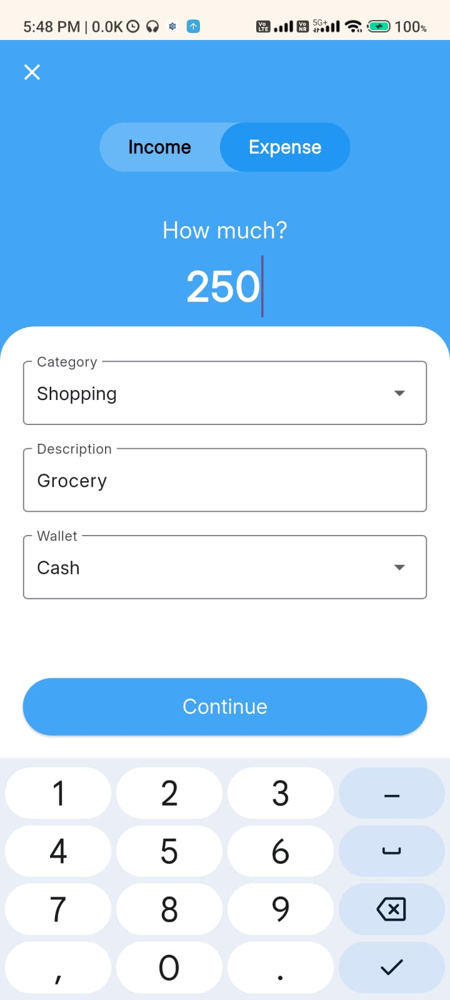
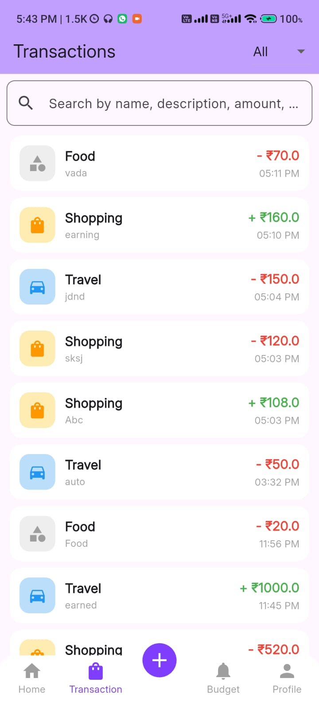
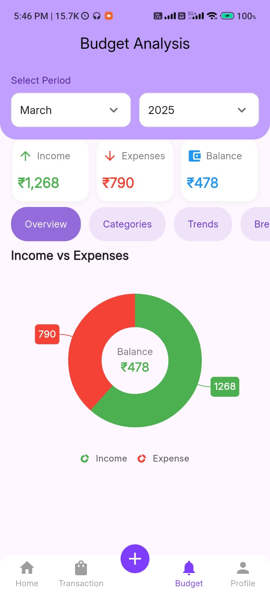
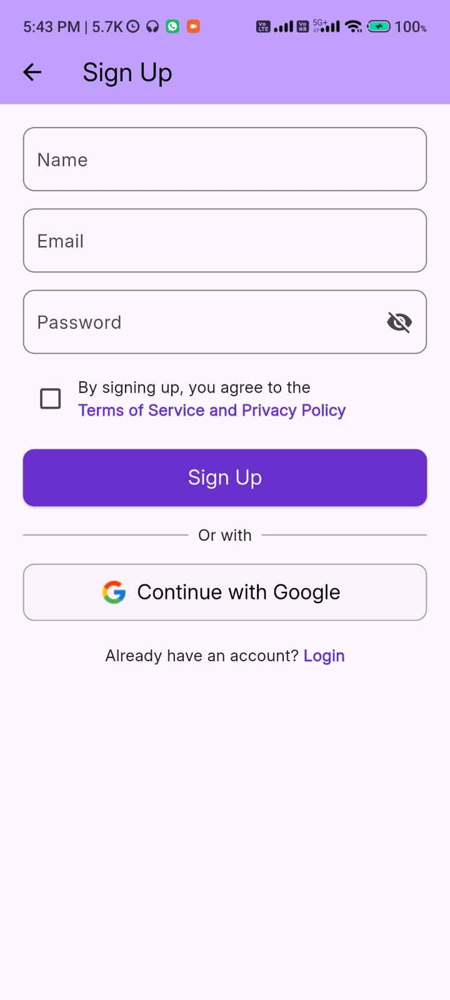
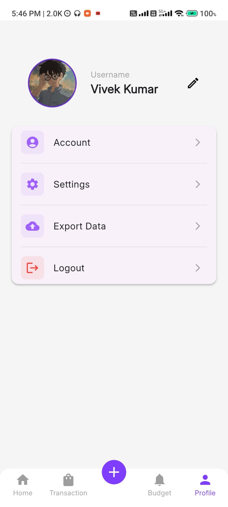

---

# **CipherX - Expense Tracker**  

A **Flutter-based Personal Expense Tracker** with **Google Authentication**, local storage using **SQFlite**, and real-time syncing with **Firebase Firestore**.  

## 🚀 **Features**  

### ✅ **Expense Tracking**  
- Add **income and expenses** with categories like **food, travel, subscriptions, and shopping**.  
- Swipe to **delete expenses** effortlessly.  
- View **income vs. expenses summary** with interactive charts.  

### 🔐 **Google Authentication**  
- Sign up / log in using **Google**.  
- Stores user data securely in **Firebase Firestore**.  
- **Auto-login** if the session is not terminated.  
- **Logout** functionality.  

### 💾 **Local Storage (SQFlite)**  
- Data is stored locally for **offline access**.  

### 🎯 **Bonus Features**  
- **Budgeting System** to track spending limits and analysis.

## 📸 **Screenshots and Presentation Video**  

| Home Screen | Add Expense | Expense List |  
|------------|------------|--------------|  
|  |  |  |  

| Summary | Login | Profile |  
|----------------|------------|----------|  
|  |  |  |  

[Presentation Video](https://github.com/user-attachments/assets/3562233c-05bc-4798-a9cd-963d6935c03e)

## 🛠 **Tech Stack**  
- **Flutter (Dart)**  
- **Firebase Authentication & Firestore**  
- **SQFlite (Local Database)**  
- **Provider (State Management)**  

## 📱 **Installation**  

1. Clone the repo:  
   ```sh
   git clone https://github.com/NITRR-Vivek/CipherSchools-Flutter-Assignment.git  
   cd CipherSchools-Flutter-Assignment  
   ```  
2. Connect your Firebase (auth and firestore)
3. Install dependencies:  
   ```sh
   flutter pub get  
   ```  
4. Run the app:  
   ```sh
   flutter run  
   ```  

## 🔗 **APK Download**  
- [Download APK](https://github.com/NITRR-Vivek/CipherSchools-Flutter-Assignment/blob/main/app-release.apk)  

---
